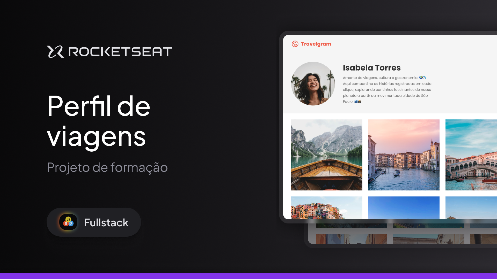

<h1 align="center"> Projeto Travelgram</h1>

Evento exclusivo , promovido pela Rocketseat para ensino de tecnologias WEB.

  <a href="#-tecnologias">Tecnologias</a>&nbsp;&nbsp;&nbsp;|&nbsp;&nbsp;&nbsp;
  <a href="#-projeto">Projeto</a>&nbsp;&nbsp;&nbsp;|&nbsp;&nbsp;&nbsp;
  <a href="#-layout">Layout</a>&nbsp;&nbsp;&nbsp;|&nbsp;&nbsp;&nbsp;
  <a href="#memo-licença">Licença</a>

  

 

  

## 🚀 Tecnologias

Esse projeto foi desenvolvido com as seguintes tecnologias:

- HTML e CSS
- Git e Github
- Figma

## 💻 Projeto

Travelgram é um projeto desenvolvido na formação Full-Stack, focado na construção do layout de um perfil para uma rede social de compartilhamento de fotos de viagem. A aplicação simula a interface de um usuário, com ênfase em organização visual, responsividade e boas práticas de desenvolvimento front-end.

## 🔖 Layout

Você pode visualizar o layout do projeto através [DESSE LINK](https://www.figma.com/design/v57OB69D8JVM7bAp64pR5i/Perfil-de-viagens--Community-?node-id=908-1045&t=Yzw2ZldVRYVLHr04-0). É necessário ter conta no [Figma](https://figma.com) para acessá-lo.

## :memo: Licença

Esse projeto está sob a licença MIT.

---

Desenvolvido por Brendow durante estudos com a Rocketseat 🚀